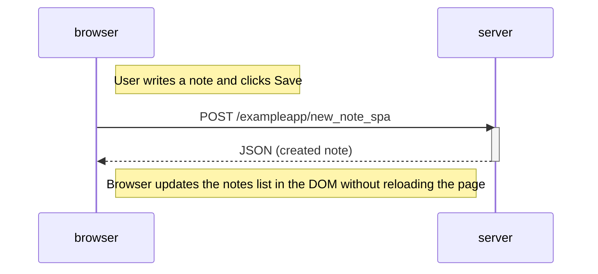

```mermaid
sequenceDiagram
    participant browser
    participant server

    Note right of browser: User writes a note and clicks Save

    browser->>server: POST /exampleapp/new_note_spa
    activate server
    server-->>browser: JSON (created note)
    deactivate server

    Note right of browser: Browser updates the notes list in the DOM without reloading the page
```
```
