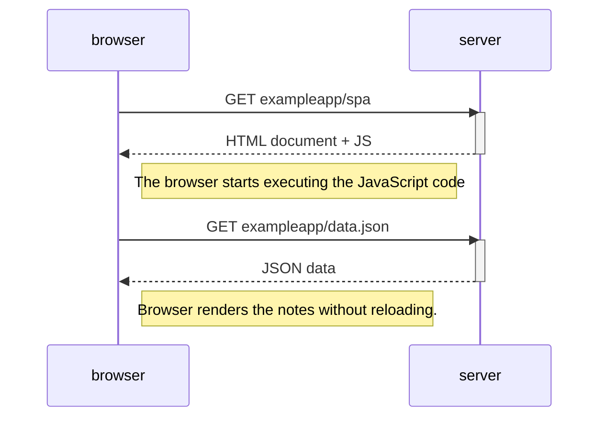

```mermaid
sequenceDiagram
    participant browser
    participant server

    browser->>server: GET exampleapp/spa 
    activate server
    server-->>browser: HTML document + JS
    deactivate server

    Note right of browser: The browser starts executing the JavaScript code

    browser->>server: GET exampleapp/data.json
    activate server
    server-->>browser: JSON data
    deactivate server

    Note right of browser: Browser renders the notes without reloading.
```
